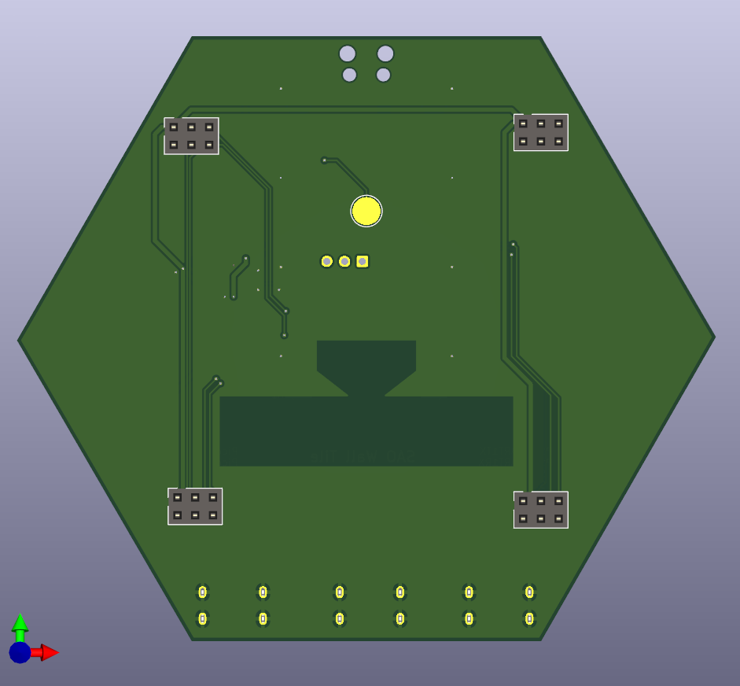

# SAO Wall

Mount your SAOs on your wall for display.

## Design Goals
* Wall-mountable: that's the point
* USB-powered: Ubiquitous and easy to acquire
* Modular and Tileable: Easy to acquire arbitrary numbers to assemble and arrange however you want
* Chainable: Can be connected together to share a power source
* Simple: Can support SAOs that only require power without software
* Smart: Can support interacting with I2C and GPIO on smart SAOs
* Accessible: Keep component cost low and hand solderable for home assembly 

## Desgin trades/notes
* USB provides 5V 3A without a PD controller, which should be enough
* SAO [1.68bis](https://docs.google.com/document/u/0/d/1EJqvkkLMAPsQ9VWF5A4elWoi0qMlKyr5Giw5rqRmtnM/mobilebasic?pli=1) spec specifies 250mA max per SAO, but most are smaller, so a 500mA 3.3V regulator seems reasonable for 4 SAOs. However it can be easily swapped for another at lower or higher current.
* I tried board-edge connectors at first, but that really complicates making arbitrary layouts. Using cables makes that way easier, and USB-C connectors seem appropriate. Also, getting alignment correct of the connectors on the 60deg edges of the hexagon seemed more difficult.
* One in and two out connectors is enough to make a binary power tree.
* 5cm per side is a nice round number, and keeps the tiles small, but big enough for the SAOs to have some space between them. Also, it should be plenty small enough for 0.3m USB cables between tiles, without being too tight or having too much extra slack to hide.
* The Raspberry Pi Pico W is optional, for talking to smart SAOs (I2C or GPIO) and controlling the 3.3V regulator to turn them on and off. A Pico 2 W should also work. I wanted this to be compatible with firmware similar to the 2024 Supercon badge.
* I picked Pico pins for 2 of the SAOs' GPIOs to be connected to UARTs on the Pico. It only has two UARTs, but at least those are options.
* I wanted to put a current shunt on the 3.3V regulator to measure the load of the SAOs, but I didn't want to have the voltage drop on that rail, or add the op-amp to measure the tiny voltage difference to do that properly. At least not on this rev, but maybe a future rev.
* No, its not going to be great RF performance from the Pico, but hopefully good enough.
* The tiles can be arranged or connected in any order. All smart behavior is localized to the one tile, so it doesn't matter where it gets connected in the chain.

## BOM
* 1x TI LM2594MX-3.3 Simple Switcher IC REG BUCK 3.3V 500MA 8SOIC [Datasheet](https://www.ti.com/lit/ds/symlink/lm2594.pdf) [Digikey](https://www.digikey.com/en/products/detail/texas-instruments/LM2594MX-3-3-NOPB/366825)
* 4x S9717-ND CONN HDR 6POS 0.1 GOLD PCB [Digikey](https://www.digikey.com/en/products/detail/sullins-connector-solutions/SFH11-NBPC-D03-ST-BK/4558818)
* 3x USB4125-GF-A CONN RCPT TYPE C 6P SMD RA [Datasheet](https://mm.digikey.com/Volume0/opasdata/d220001/medias/docus/6501/USB4125%20Product%20Spec.pdf) [Digikey](https://www.digikey.com/en/products/detail/gct/USB4125-GF-A/13547388)
* 2x 5.1k 0603 Resistor [Digikey](https://www.digikey.com/en/products/detail/yageo/RC0805JR-075K1L/728338)
* 1x 68uF+ Capacitor [Digikey](https://www.digikey.com/en/products/detail/chinsan-elite/CTB1A101MCB0558/16496866)
* 1x 120uF+ Capactior [Digikey](https://www.digikey.com/en/products/detail/chemi-con/EMVE100ARA151MF80G/756835)
* 1x Schottky Diode [Digikey](https://www.digikey.com/en/products/detail/shenzhen-slkormicro-semicon-co-ltd/1N5817W/25701312)
* 1x 68uH Inductor [Digikey](https://www.digikey.com/en/products/detail/taiyo-yuden/NRS6028T680MMGJ/2665982)

Digikey Shopping Cart: https://www.digikey.com/short/jzd2qm89

Optional
* 1x Raspberry Pi Pico (2) W  [Pico W Datasheet](https://datasheets.raspberrypi.com/picow/pico-w-datasheet.pdf) [Pico 2 W Datasheet](https://datasheets.raspberrypi.com/picow/pico-2-w-datasheet.pdf)
* 2x 5.1k 0603 Resistors
* 1x Schottky 0603 Diode

# Renders

